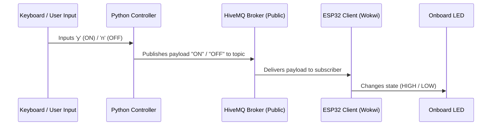

# 💡 Smart LED Control via MQTT & ESP32

An IoT simulation demonstrating real-time hardware control via an MQTT publish-subscribe mechanism. The system features a simulated **ESP32 microcontroller** in Wokwi subscribing to a topic on a public broker, and a **Python Controller** publishing commands based on keyboard input.

---

## 🏗️ Architecture Flow



---

## 📂 File Breakdown

*   [sketch.ino](file:///home/sudip-kumar-saha/Desktop/CSE-322-Computer%20Network/IoT%20Assignment/sketch.ino): ESP32 firmware configures Wi-Fi (`Wokwi-GUEST`) and subscribes to the MQTT topic:
    `buet/cse/2105152/led`
*   [sample_for_control.py](file:///home/sudip-kumar-saha/Desktop/CSE-322-Computer%20Network/IoT%20Assignment/sample_for_control.py): Console-based python application using `paho-mqtt` that listens to user commands and publishes control payloads to HiveMQ.

---

## 🚀 Setup & Execution

### 1. Run the Python Controller

Prerequisites: Python 3 and `paho-mqtt`.

```bash
# Create and activate virtual environment
python3 -m venv venv
source venv/bin/activate

# Install requirements
pip install paho-mqtt

# Run script
python sample_for_control.py
```

> [!NOTE]
> Keyboard Commands:
> *   `y` ➔ Turns LED **ON** (sends message `"ON"`)
> *   `n` ➔ Turns LED **OFF** (sends message `"OFF"`)
> *   `q` ➔ **Exit** application

### 2. Run the ESP32 Simulation

1. Open [sketch.ino](file:///home/sudip-kumar-saha/Desktop/CSE-322-Computer%20Network/IoT%20Assignment/sketch.ino).
2. Copy contents into your [Wokwi](https://wokwi.com/) ESP32 simulator.
3. Verify that the MQTT topic `buet/cse/2105152/led` matches in both script and ESP32 sketch.
4. Start the simulation in Wokwi.
