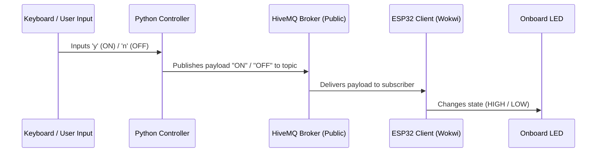

<div align="center">

# 💡 Smart LED Control via MQTT & ESP32

**An IoT publish-subscribe simulation system** demonstrating real-time hardware control.  
Features an ESP32 client simulated in Wokwi subscribing to payloads and a local Python command-line publisher.

[](https://www.python.org)
[](https://www.arduino.cc/)
[](https://mqtt.org)
[](https://wokwi.com)
[](./LICENSE)

[Features](#-features) · [Architecture](#-architecture-flow) · [Setup & Execution](#-setup--execution)

</div>

---

## ✨ Features

| Feature | Description |
|---|---|
| 📡 **Real-time MQTT Pub/Sub** | Uses public HiveMQ broker for low-latency transmission. |
| 🐍 **Python Controller** | Keyboard-driven CLI client that publishes control signals. |
| 🎛️ **Simulated Hardware** | ESP32 client with onboard LED reacting instantly to commands. |
| 🔌 **Offline Resiliency** | Automatic reconnection handler for Wi-Fi and MQTT connection drops. |

---

## 🏗️ Architecture Flow



---

## 🛠️ Tech Stack

| Layer | Technology | Purpose |
|---|---|---|
| **Firmware** | Arduino C++ / ESP32 WiFi | Controls the board state and subscriptions |
| **Controller** | Python 3 + `paho-mqtt` | Interactive CLI client application |
| **Broker** | HiveMQ (Public Broker) | Routes MQTT messages between publisher and subscriber |
| **Simulation** | Wokwi | Emulates physical ESP32 and WiFi link |

---

## 📂 Project Structure

```
├── sketch.ino               # ESP32 Wi-Fi & MQTT subscriber firmware
└── sample_for_control.py    # Python controller CLI script
```

---

## 🚀 Setup & Execution

### 1. Run the Python Controller

Prerequisites: Python 3 and a virtual environment.

```bash
# Create and activate virtual environment
python3 -m venv venv
source venv/bin/activate

# Install dependencies
pip install paho-mqtt

# Run control script
python sample_for_control.py
```

> [!NOTE]
> **Keyboard CLI Bindings:**
> *   `y` ➔ Turns LED **ON** (publishes `"ON"`)
> *   `n` ➔ Turns LED **OFF** (publishes `"OFF"`)
> *   `q` ➔ **Quit** application

### 2. Run the ESP32 Simulation

1. Open [sketch.ino](file:///home/sudip-kumar-saha/Desktop/CSE-322-Computer%20Network/IoT%20Assignment/sketch.ino).
2. Copy its code and paste it into your [Wokwi](https://wokwi.com/) ESP32 project.
3. Ensure the target topic configured is `buet/cse/2105152/led`.
4. Run the simulator. The ESP32 will connect to `Wokwi-GUEST` WiFi and wait for publish events.
