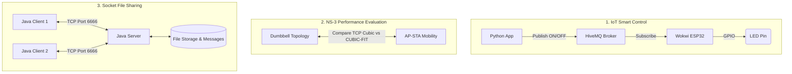

<div align="center">

# 🌐 CSE-322: Computer Networks Assignments

**A collection of core networking systems and simulations** built for the **CSE-322 Computer Networks Sessional** course.  
Implements three distinct assignments covering physical hardware protocols, socket communications, and protocol simulations.

[](https://www.oracle.com/java/)
[](https://www.python.org)
[](https://isocpp.org)
[](https://mqtt.org)
[](https://www.nsnam.org)
[](./LICENSE)

[IoT Control](#-iot-assignment) · [NS-3 Simulations](#-ns3-project) · [Socket File Share](#-socket-programming-assignment)

</div>

---

## 📂 Assignments Overview

| Subfolder | Type | Key Features |
|---|---|---|
| 💡 **[IoT Assignment](./IoT%20Assignment)** | Physical / Simulated IoT | ESP32-Wokwi firmware, HiveMQ MQTT broker, command-line Python publisher |
| 📊 **[NS3-Project](./NS3-Project)** | Network Simulation | TCP Cubic vs CUBIC-FIT, wired dumbbell layout, wireless STA-AP model with mobility & energy tracking |
| 🔌 **[Socket Programming Assignment](./Socket%20Programming%20Assignment)** | System Development | Multi-threaded Java TCP server/client, background chunked file transfer, persistent user auth, offline queuing |

---

## 🏗️ Integrated Architecture



---

## 🛠️ Tech Stack

<table>
<tr><th>Layer</th><th>Technology</th><th>Purpose</th></tr>
<tr><td rowspan="3"><strong>Languages</strong></td><td>Java 17+</td><td>Multi-threaded Socket Programming Assignment</td></tr>
<tr><td>Python 3.8+</td><td>IoT Control application & data plotting scripts</td></tr>
<tr><td>C++ 17</td><td>ns-3 network simulations</td></tr>
<tr><td rowspan="3"><strong>Protocols</strong></td><td>TCP Sockets</td><td>Custom chunk-negotiated file sharing protocol</td></tr>
<tr><td>MQTT (v3.1.1)</td><td>Low-bandwidth publisher-subscriber messaging</td></tr>
<tr><td>802.11 (Wi-Fi)</td><td>Wireless station mobility simulations</td></tr>
<tr><td rowspan="2"><strong>Simulators & Toolkits</strong></td><td>ns-3.45</td><td>Discrete-event network simulator</td></tr>
<tr><td>Wokwi</td><td>ESP32 hardware simulation environment</td></tr>
</table>

---

## 📂 Project Structure

```
├── IoT Assignment/
│   ├── sketch.ino               # ESP32 MQTT subscriber source
│   └── sample_for_control.py    # Python publisher interface
├── NS3-Project/
│   ├── ns-3.45/
│   │   └── scratch/
│   │       ├── cubic-fit-wired.cc      # Wired dumbbell simulation
│   │       └── cubic-fit-wireless.cc   # Wireless mobility & energy simulation
│   └── README.md                # ns-3 configuration details
├── Socket Programming Assignment/
│   ├── FileServer.java          # Multi-threaded server backend
│   ├── FileClient.java          # Interactive menu frontend
│   ├── ClientThread.java        # Individual socket handler
│   ├── UploadFile.java          # Async file transmitter
│   ├── DownloadFile.java        # Async file receiver
│   └── README.md                # Custom TCP protocol reference
└── README.md                    # Root repository index
```

---

## 🚀 Getting Started

### 1. Initialize local setup
Clone this repository and verify your toolchains (JDK 17+, Python 3, G++):
```bash
git clone https://github.com/YOUR_USERNAME/CSE-322-Computer-Network.git
cd CSE-322-Computer-Network
```

### 2. Run Individual Modules
Explore each subfolder for detailed deployment logs and custom command guidelines:
*   Read the **[IoT Guide](./IoT%20Assignment/README.md)** for MQTT broker configuration.
*   Read the **[NS-3 Guide](./NS3-Project/README.md)** for compilation command parameters.
*   Read the **[Socket Guide](./Socket%20Programming%20Assignment/README.md)** for compilation commands and server port specs.

---

## 📝 License

This project is licensed under the [MIT License](./LICENSE).
