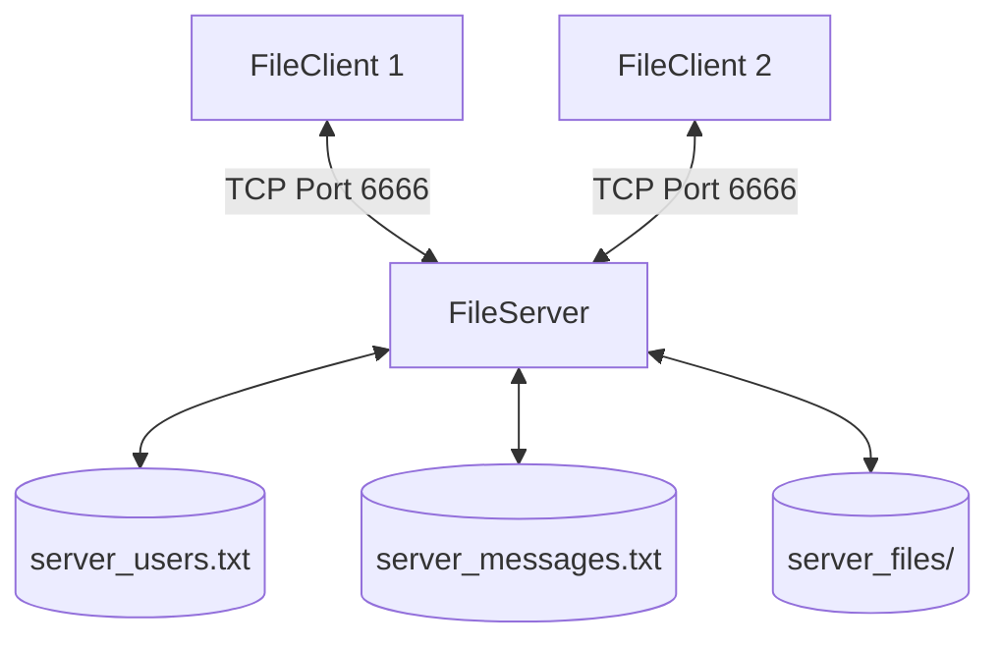

# 🔌 Multi-Threaded TCP File Sharing System

A robust, Java-based client-server platform designed for concurrent file sharing. It implements a custom command-based TCP protocol, background transfer routines, and persistent user/message state tracking.

---

## 🏗️ System Architecture



---

## 📂 Core Components

### Backend (Server)
*   [FileServer.java](file:///home/sudip-kumar-saha/Desktop/CSE-322-Computer%20Network/Socket%20Programming%20Assignment/FileServer.java): Initializes the server socket, manages connected users, buffers offline messages, and monitors the overall storage buffer.
*   [ClientThread.java](file:///home/sudip-kumar-saha/Desktop/CSE-322-Computer%20Network/Socket%20Programming%20Assignment/ClientThread.java): Handles server-side communication per connected client concurrently.

### Frontend (Client)
*   [FileClient.java](file:///home/sudip-kumar-saha/Desktop/CSE-322-Computer%20Network/Socket%20Programming%20Assignment/FileClient.java): An interactive command-line interface featuring options for listing clients, uploading/downloading, messaging, and checking history.

### Transfer Helpers
*   [UploadFile.java](file:///home/sudip-kumar-saha/Desktop/CSE-322-Computer%20Network/Socket%20Programming%20Assignment/UploadFile.java) / [DownloadFile.java](file:///home/sudip-kumar-saha/Desktop/CSE-322-Computer%20Network/Socket%20Programming%20Assignment/DownloadFile.java): Asynchronous background threads that transmit files using chunked socket byte streams.

---

## 💬 Protocol Command Reference

| Client Request | Server Response | Description |
|---|---|---|
| `LIST_CLIENTS:` | `CLIENTS:[csv_list]` | Returns online & offline registered users. |
| `LIST_OWN_FILES:` | `OWN_FILES:[csv_list]` | Returns the caller's uploaded files and visibility. |
| `LIST_PUBLIC_FILES:[username]` | `PUBLIC_FILES:[csv_list]` | Returns public files owned by the specified user. |
| `UPLOAD_REQUEST:[metadata]` | `UPLOAD_READY:[id],[chunk]` | Negotiates chunk size and visibility for upload. |
| `VIEW_MESSAGES:` | `MESSAGES:[pipe_separated]` | Retrieves pending offline notifications/requests. |

---

## 🚀 Compilation & Usage

### 1. Compile all Java source files
```bash
javac *.java
```

### 2. Start the File Server
```bash
java FileServer
```
*The server will run on port `6666` and load user/message data.*

### 3. Launch the File Client
```bash
java FileClient
```
*Run multiple instances in separate terminal windows to simulate multiple users.*
