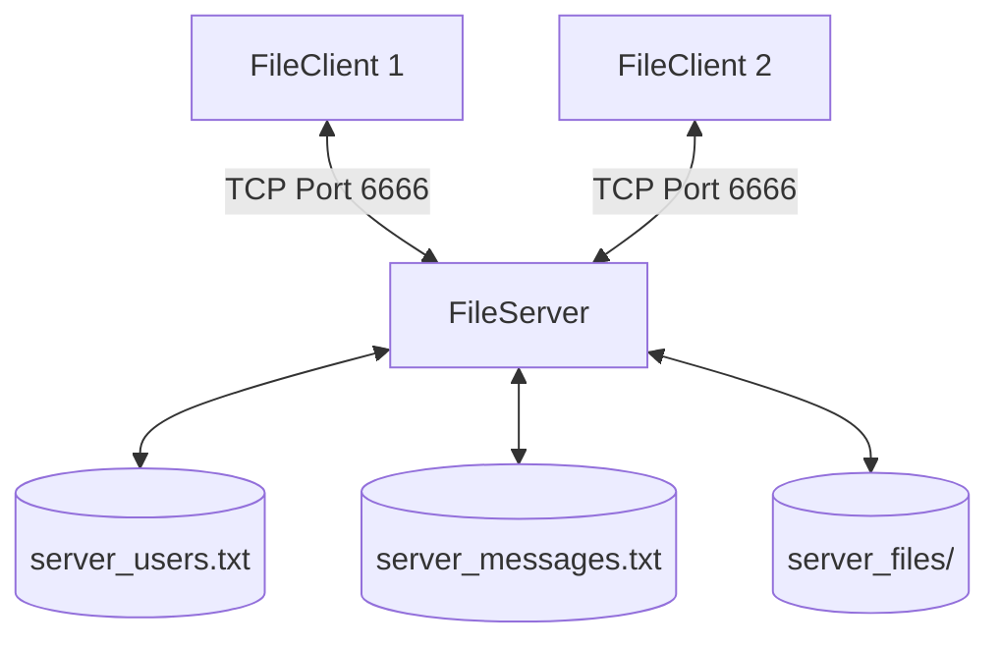

<div align="center">

# 🔌 Multi-Threaded TCP File Sharing System

**A robust Java-based client-server platform** designed for concurrent file sharing.  
Implements a custom command-based TCP protocol, background transfer routines, and persistent user/message state tracking.

[](https://www.oracle.com/java/)
[](https://docs.oracle.com/en/java/)
[](https://en.wikipedia.org/wiki/Transmission_Control_Protocol)
[](./LICENSE)

[Features](#-features) · [Architecture](#-system-architecture) · [Protocol Commands](#-protocol-command-reference) · [Compilation & Usage](#-compilation--usage)

</div>

---

## ✨ Features

| Feature | Description |
|---|---|
| 👥 **User Authentication** | Simple lookup of known registered users with persistent saving on server shutdowns. |
| 📁 **File Transmission** | Chunked background file uploads/downloads with customizable public or private visibility. |
| 🔀 **Concurrency** | Thread-per-client model using raw TCP sockets (`java.net.ServerSocket`). |
| 💬 **Offline Messaging** | Queues alerts and download requests for offline users, delivering them immediately upon next login. |
| 📂 **Buffered Storage** | Configurable server-wide transfer buffer limits with automatic chunk size negotiation. |

---

## 🏗️ System Architecture



---

## 🛠️ Tech Stack

| Layer | Technology | Purpose |
|---|---|---|
| **Language** | Java 17+ | Standard JDK features, multithreading, and network streams |
| **Networking** | standard socket API (`java.net.Socket`) | Custom TCP command structure routing and packet framing |
| **Persistence** | Flat-file storage (`.txt`) | Tracks active client lists and offline message queues |

---

## 📂 Project Structure

```
├── FileServer.java          # Listening socket entrypoint and main server execution thread
├── FileClient.java          # Console-based client interface with interactive menus
├── ClientThread.java        # Thread spawned per client connection at the server
├── UploadFile.java          # Background worker executing chunked uploads
├── DownloadFile.java        # Background worker executing chunked downloads
└── README.md                # Subproject documentation
```

---

## 📡 Protocol Command Reference

All messages are exchanged as raw ASCII/UTF-8 string headers followed by binary streams where necessary.

<details>
<summary><strong>👥 Client Management & User Files</strong></summary>

| Request Header | Success Response | Description |
|---|---|---|
| `LIST_CLIENTS:` | `CLIENTS:[csv_list]` | Returns registered clients and their online status (e.g. `userA(online)`). |
| `LIST_OWN_FILES:` | `OWN_FILES:[csv_list]` | Returns caller's uploaded files (e.g. `file1.pdf(private)`). |
| `LIST_PUBLIC_FILES:[target]` | `PUBLIC_FILES:[csv_list]` | Lists all public files owned by `target`. |

</details>

<details>
<summary><strong>📥 File Uploads & Downloads</strong></summary>

| Request Header | Success Response | Description |
|---|---|---|
| `UPLOAD_REQUEST:[name],[size],[vis]` | `UPLOAD_READY:[fileId],[chunkSize]` | Initiates upload; server replies with assigned ID & chunk size. |
| `DOWNLOAD_REQ:[owner],[filename]` | Staged binary streams | Pulls file binary stream from the server storage bucket. |

</details>

<details>
<summary><strong>🔔 Messaging & Requests</strong></summary>

| Request Header | Success Response | Description |
|---|---|---|
| `REQ_SEND:[recipient],[details]` | `SUCCESS:` | Submits file request. Server forwards instantly or saves to offline queue. |
| `VIEW_MESSAGES:` | `MESSAGES:[pipe_separated]` | Fetches unread file requests or login notifications. |

</details>

---

## 🚀 Compilation & Usage

### 1. Compile all Java source files
```bash
javac *.java
```

### 2. Start the File Server
```bash
java FileServer
```
*The server will boot up and start listening on port `6666`.*

### 3. Launch the File Client
```bash
java FileClient
```
*Spawn multiple terminal instances to test cross-client notifications and chunked file sharing.*
